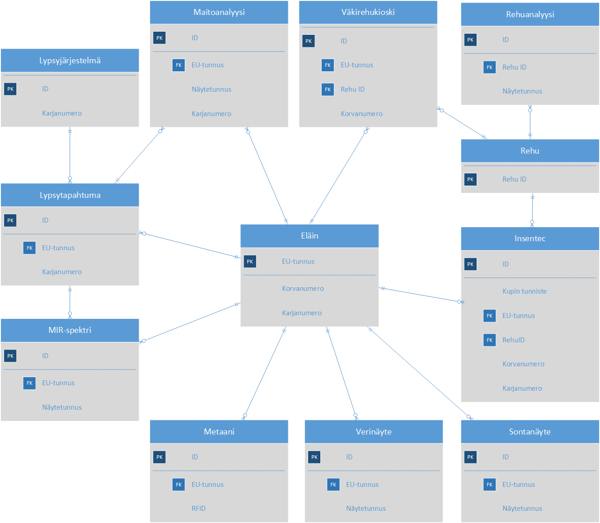

<table>
<colgroup>
<col style="width: 9%" />
<col style="width: 12%" />
<col style="width: 15%" />
<col style="width: 62%" />
</colgroup>
<thead>
<tr class="header">
<th> 
Versio</th>
<th>Päiväys</th>
<th>Tekijä</th>
<th>Muutokset</th>
</tr>
</thead>
<tbody>
<tr class="odd">
<td>0.1</td>
<td>12.5.2021</td>
<td>Kuisma Lehtonen</td>
<td>Alustava versio</td>
</tr>
<tr class="even">
<td>0.2</td>
<td>3.6.2021</td>
<td>Kuisma Lehtonen</td>
<td>Päivitetty 31.5.2021 palaverin kommenttien perusteella</td>
</tr>
<tr class="odd">
<td>0.3</td>
<td>8.6.2021</td>
<td>Kuisma Lehtonen</td>
<td>Päivitetty 7.6.2021 sprintin suunnittelun perusteella</td>
</tr>
<tr class="even">
<td>0.4</td>
<td>23.6.2021</td>
<td>Kuisma Lehtonen</td>
<td>Päivitetty 22.6.2021 sprintin suunnittelun perusteella. Ruokintatapahtumat yhdistetään, metaani-&gt;kaasumittausjärjestelmän tiedot, poistetaan koe pilotin tietomallista, englanninkieliset termit.</td>
</tr>
<tr class="odd">
<td>0.5</td>
<td>30.6.2021</td>
<td>Kuisma Lehtonen</td>
<td>Täsmennetty koodistojen arvoja sprint suunnittelun yhteydessä 30.6.2021</td>
</tr>
<tr class="even">
<td>0.6</td>
<td>21.9.2021</td>
<td>Kuisma Lehtonen</td>
<td>Tarkistettu käännös Poikimakerta (Calving number-&gt;Parity)</td>
</tr>
</tbody>
</table>

# Sisällys

[1. Relaatiokaavio 4](#relaatiokaavio)

[2. Eläimen perustiedot (Animal) 4](#eläimen-perustiedot-animal)

[2.1. Poikiminen (Calving) 5](#poikiminen-calving)

[2.2. Siemennys (Insemination) 5](#siemennys-insemination)

[2.3. Tiineystarkastus (Pregnancy check)
6](#tiineystarkastus-pregnancy-check)

[2.4. Eläimen paino (Weight) 6](#eläimen-paino-weight)

[3. Ruokintatapahtuma (Feeding) 7](#ruokintatapahtuma-feeding)

[4. Lypsyjärjestelmä (Milking system)
7](#lypsyjärjestelmä-milking-system)

[5. Lypsytapahtuma (Milking event) 8](#lypsytapahtuma-milking-event)

[6. Kaasumittausjärjestelmän tiedot (Gas system)
9](#kaasumittausjärjestelmän-tiedot-gas-system)

[7. Maitoanalyysi (Milk analysis) 10](#maitoanalyysi-milk-analysis)

[8. Rehuanalyysi (Feed analysis) 10](#rehuanalyysi-feed-analysis)

[9. Rehu (Feed) 12](#rehu-feed)

[10. Verinäytteet (Blood sample) 13](#verinäytteet-blood-sample)

[11. Sontanäytteet (Manure sample) 13](#sontanäytteet-manure-sample)

[12. MIR spektrit (MIR spectrum) 14](#mir-spektrit-mir-spectrum)

[13. Koodistot 15](#koodistot)

[13.1. Eläimen perustiedot: Rotu (Breed)
15](#eläimen-perustiedot-rotu-breed)

[13.2. Navetta (Barn) 15](#navetta-barn)

[13.3. Organisaatio (Organization) 15](#organisaatio-organization)

[13.1. Laitteiston tunnisteet (Equipment Id)
15](#laitteiston-tunnisteet-equipment-id)

[13.1. Laboratorio (Laboratory) 16](#laboratorio-laboratory)

[13.1. Ruokintatapahtuman tyyppi (Feeding type)
16](#ruokintatapahtuman-tyyppi-feeding-type)

[13.2. Siemennystapa (Seeding type) 16](#siemennystapa-seeding-type)

[13.3. Mittaustapa (Measurement type) 16](#mittaustapa-measurement-type)

Johdanto

Alla kuvatuissa taulukoissa on järjestelty FinLive-hankkeen tietomallin
attribuutit taulukoihin.

Attribuuttilistojen jälkeen dokumentissa on tietomallin määrittelyn
yhteydessä järjestelmään koodistoiksi tunnistetut tiedot ja niiden
alustavat arvolistat.

Pääluvuissa 1-24 oleviin taulukoihin liittyy seuraavia lukuohjeita:

-   Tunnus kuvaa tässä dokumentissa identifioituja attribuutteja tai
    tietorakenteita. Nämä samat tunnukset ovat käytössä tämän dokumentin
    pohjalta piirretyssä UML-kaaviossa

-   Nimi/Relaatio rooli kuvaa attribuutin, tietorakenteen tai relaation
    nimeä.

-   Tyyppi kertoo, mitä tyyppiä määritelty attribuutti on.

    -   Relaatio tarkoittaa sitä, että kyseinen attribuutti viittaa tai
        rakentuu rakenteellisesta entiteetistä, joita luvut 1-12
        kuvaavat. Relaation yhteydessä on aina ilmaistu rakenteellinen
        entiteetti ja tämän nimi toimii linkkinä dokumentin sisällä ko.
        entiteettiin.

    -   Koodisto tarkoittaa sitä, että attribuutti voi saada arvonsa
        tietystä koodistosta, jotka on määritelty luvussa 12. Tyypin
        yhteydessä on aina ilmaistu koodiston luvun numero ja tämän
        nimi, jotka molemmat toimivat tämän dokumentin sisällä linkkinä
        ko. koodistoon.

    -   Teksti tarkoittaa tekstimuotoista arvoa, jonka pituuksia ei
        toistaiseksi ole ollut tarvetta rajoittaa

    -   Luku kuvaa lähtökohtaisesti arvoa, jonka tarkkuus on
        tarkimmillaan kaksi desimaalia

    -   Kokonaisluku tarkoittaa lukua, jolla ei ole desimaaleja

    -   Boolean tarkoittaa datatyyppiä, joka voi saada arvoksi joko
        yes (y) tai no (n) (tai true tai false)

-   Toistettavuus kertoo, onko tietty attribuutti tai liitos pakollinen
    ja toistettava

    -   0…1 -> valinnainen, ei voida toistaa

    -   0…n -> valinnainen, voidaan toistaa

    -   1…1 -> pakollinen, ei voida toistaa

    -   1…n -> pakollinen, voidaan toistaa

-   Kuvaus kuvaa kyseistä attribuuttia tai liitosta ja sen tarkoitusta –
    joskus jopa esimerkein.

-   Viittaus tarkoittaa kohdetta tämän dokumentin ulkopuolelle. Viitattu
    kohde vastaa tämän dokumentin attribuuttia tai suhdetta. Viittausta
    on käytetty lähinnä viittamaan standardeihin (ja
    siirtoformaatteihin).

-   Pää- tai alalukujen otsikoiden jälkeen on listattu ne taulukoissa
    olevat attribuutit, joista on viitattu kyseiseen pää- tai alalukuun.
    Attribuutin tunnuksen jälkeen suluissa on linkki siihen pää- tai
    alalukuun, josta attribuutti löytyy.

# 

# Relaatiokaavio

# Eläimen perustiedot (Animal)

Viitattu: POI1(2.1), SIE1(2.2), TII1(2.3), EPA1(2.4), RU03(3), LT01(6),
KA02(7), MA01(8), RE01(10), VE01(11), SO01(12), MI01(13)

| Tunnus | Nimi / Relaatio rooli                      | Tyyppi                              | Toistettavuus | Kuvaus                                       | Viittaus |
|--------|--------------------------------------------|-------------------------------------|---------------|----------------------------------------------|----------|
| EL01   | EU-tunnus (EU ID)                          | Merkkijono                          | 1..1          | Eläimen yksilöivä globaalisti uniikki tunnus |          |
| EL02   | Nimi (Name)                                | Merkkijono                          | 0..1          | Eläimen nimi                                 |          |
| EL03   | Rotu (Breed)                               | Koodisto: Eläimen perustiedot: Rotu | 0..1          | Eläimen rotu                                 |          |
| EL04   | Sukupuoli (Gender)                         | Koodisto: Female/Male               | 0..1          | Eläimen sukupuoli                            |          |
| EL05   | Syntymäpäivä (Birth date)                  | Päivämäärä                          | 0..1          |                                              |          |
| EL05   | Korvanumero (Animal ID)                    | Merkkijono                          | 0..1          | Eläimen Korvanumero tilalla.                 |          |
|        |                                            |                                     |               |                                              |          |
| EL06   | Karjanumero (Farm ID)                      | Koodisto: Navetta                   | 0..1          | Eläimen Karjanumero (navettakohtainen)       |          |
| EL07   | Tilalle tulo (Arrival date)                | Päivämäärä                          | 0..1          | Osto- tai syntymäpäivä                       |          |
| EL08   | Poikiminen (Calving)                       | Relaatio: Poikiminen                | 0..n          | Tiedot poikimisesta                          |          |
| EL09   | Siemennys (Insemination)                   | Relaatio: Siemennys                 | 0..n          |                                              |          |
| EL010  | Tiineystarkastus (Gestation inspection)    | Relaatio: Tiineystarkastus          | 0..n          |                                              |          |
| EK11   | Paino (Weight)                             | Relaatio: Eläimen paino             | 0..n          |                                              |          |
| EK12   | Tilalta poistopvm (Departure data)         | Päivämäärä                          | 0..1          |                                              |          |
| EK13   | Tilalta poistaminen syy (Departure reason) | Merkkijono                          | 0..1          |                                              |          |
| EK14   | Organisaatio (Organization)                | Koodisto: Organisaatio              | 1..1          |                                              |          |

## Poikiminen (Calving)

Viitattu: EL07(2)

Tiedot eläimen poikimisesta.

| Tunnus | Nimi / Relaatio rooli    | Tyyppi                        | Toistettavuus | Kuvaus                                       | Viittaus |
|--------|--------------------------|-------------------------------|---------------|----------------------------------------------|----------|
| POI1   | EU-tunnus (EU Id)        | Relaatio: Eläimen perustiedot | 1..1          | Eläimen yksilöivä globaalisti uniikki tunnus |          |
| POI2   | Päivämäärä (Date)        | Päivämäärä                    | 1..1          | Poikimispäivä                                |          |
| POI3   | Avustaminen (Assistance) | Boolean?                      | 1..1          | Tieto avustamisesta                          |          |
| POI4   | Poikimakerta (Parity)    | Kokonaisluku                  | 1..1          | Parity                                       |          |

## Siemennys (Insemination)

Viitattu: EL08(2)

Tiedot eläimen poikimisesta.

| Tunnus | Nimi / Relaatio rooli               | Tyyppi                                        | Toistettavuus | Kuvaus                                                                    | Viittaus |
|--------|-------------------------------------|-----------------------------------------------|---------------|---------------------------------------------------------------------------|----------|
| SIE1   | EU-tunnus (EU Id)                   | Relaatio: Eläimen perustiedot                 | 1..1          | Eläimen yksilöivä globaalisti uniikki tunnus                              |          |
| SIE2   | Päivämäärä (Date)                   | Päivämäärä                                    | 1..1          | Poikimispäivä                                                             |          |
| SIE3   | Sonni (Bull)                        | Merkkijono                                    | 1..1          | Sonnin nimi (Tarvitaanko viittaus tiettyyn eläimeen EU-tunnuksen avulla?) |          |
| SIE4   | Siemennystapa (Insemination method) | Koodisto: Siemennystapa (Insemination method) | 1..1          |                                                                           |          |

## Tiineystarkastus (Pregnancy check)

Viitattu: EL09(2)

Tiedot eläimen poikimisesta.

| Tunnus | Nimi / Relaatio rooli                | Tyyppi                        | Toistettavuus | Kuvaus                                       | Viittaus |
|--------|--------------------------------------|-------------------------------|---------------|----------------------------------------------|----------|
| TII1   | EU-tunnus (EU Id)                    | Relaatio: Eläimen perustiedot | 1..1          | Eläimen yksilöivä globaalisti uniikki tunnus |          |
| TII2   | Päivämäärä (Date)                    | Päivämäärä                    | 1..1          | Poikimispäivä                                |          |
| TII3   | Tulos (Result)                       | Boolean                       | 1..1          | Sonnin nimi                                  |          |
| TII4   | Odotettu poikimapäivä (Calving date) | Päivämäärä                    | 1..1          | Arvioitu poikimapäivä                        |          |

## Eläimen paino (Weight)

Viitattu: EL10(2)

Punnitus automaattimittaukselle sekä punnitus erillisellä eläinvaa’alla
(Viikki).

| Tunnus | Nimi / Relaatio rooli         | Tyyppi                                   | Toistettavuus | Kuvaus                                       | Viittaus |
|--------|-------------------------------|------------------------------------------|---------------|----------------------------------------------|----------|
| EPA1   | EU-tunnus (EU Id)             | Relaatio: Eläimen perustiedot            | 1..1          | Eläimen yksilöivä globaalisti uniikki tunnus |          |
| EPA2   | Aikaleima (Time stamp)        | Aikaleima                                | 1..1          | Päivämäärä ja kellonaika                     |          |
| EPA3   | Paino (Weight)                | Desimaaliluku                            | 1..1          | Paino (kg)                                   |          |
| EPA4   | Syöttötapa (Measurement type) | Koodisto: Mittaustapa (Measurement type) | 1..1          | Automaatti/manuaalimittaus                   |          |
| EPA5   | Equipment Id                  | Merkkijono                               | 1..1          |                                              |          |

# Ruokintatapahtuma (Feeding)

Viitattu: EL01(2)

Syöttötapahtuma. Automaattimittaus Insentec RIC-kupeilla, erillisessä
väkirehukioskissa tai lypsyrobotilla.

| Tunnus | Nimi / Relaatio rooli                | Tyyppi                                          | Toistettavuus | Kuvaus                                                              | Viittaus |
|--------|--------------------------------------|-------------------------------------------------|---------------|---------------------------------------------------------------------|----------|
| RU01   | Laitetunnus (Equipment Id)           | Koodisto: Laitteiston tunnisteet (Equipment Id) | 1..1          | Laitteiston yksilöivä tunniste. Insentec-laitteistolla kupin numero |          |
| RU02   | Tyyppi (Equipment type)              | Koodisto: Ruokintalaitteen (Feeding type)       | 1..1          | Insentec/väkirehukioski/lypsyrobotti                                |          |
| RU03   | EU-tunnus (EU Id)                    | Relaatio: Eläimen perustiedot                   | 1..1          | Eläimen yksilöivä globaalisti uniikki tunnus                        |          |
| RU04   | RFID                                 | Merkkijono                                      | 1..1          | Lehmän Insentec RFID numero                                         |          |
| RU05   | Korvanumero (Animal ID)              | Merkkijono                                      | 1..1          | Lehmän Korvanumero                                                  |          |
| RU06   | Karjanumero (Farm ID)                | Koodisto: Navetta                               | 1..1          | Eläimen Karjanumero (navettakohtainen)                              |          |
| RU07   | Käynnin alkuaika (Visit start time)  | Aikaleima                                       | 1..1          |                                                                     |          |
| RU08   | Käynnin loppuaika (Visit end time)   | Aikaleima                                       | 0..1          |                                                                     |          |
| RU09   | Käynnin kesto (Visit duration)       | Aika                                            | 0..1          | Käynnin kesto (s)                                                   |          |
| RU10   | Rehun paino (Feed weight)            | Desimaaliluku                                   | 0..1          | Rehun paino kupissa käynnin alussa                                  |          |
| RU11   | Rehun kulutus (Feed consumption)     | Desimaaliluku                                   | 0..1          | Rehun kulutus/kg                                                    |          |
| RU12   | Rehu ID (Feed Id)                    | Relaatio: Rehu                                  | 1..1          |                                                                     |          |
| RU13   | Organisaatio (Organization)          | Koodisto: Organisaatio                          | 1..1          |                                                                     |          |

# Lypsyjärjestelmä (Milking system)

Viitattu: LT10(5.1)

Jokioisilla lypsyasema, Viikissä lypsyrobotti, Maaningalla syksyllä 2021
lypsyrobotti.

| Tunnus | Nimi / Relaatio rooli          | Tyyppi                           | Toistettavuus | Kuvaus                                        | Viittaus |
|--------|--------------------------------|----------------------------------|---------------|-----------------------------------------------|----------|
| LJ01   | Tunniste (Equipment Id)        | Relaatio: Laitteiston tunnisteet | 1..1          | Lypsyjärjestelmän yksilöivä tunniste          |          |
| LJ02   | Karjanumero (Farm ID)          | Koodisto: Navetta                | 1..1          | Eläimen Karjanumero (Barn) (navettakohtainen) |          |
| LJ03   | Organisaatio (Organization)    | Koodisto: Organisaatio           | 1..1          |                                               |          |
| LJ04   | Lypsytapahtuma (Milking event) | Relaatio: Lypsytapahtuma         | 0..n          |                                               |          |

# Lypsytapahtuma (Milking event)

Viitattu: EL01(2), MA08(8),MI10(13)

| Tunnus | Nimi / Relaatio rooli                          | Tyyppi                        | Toistettavuus | Kuvaus                                                             | Viittaus |
|--------|------------------------------------------------|-------------------------------|---------------|--------------------------------------------------------------------|----------|
| LT01   | EU-tunnus (EU Id)                              | Relaatio: Eläimen perustiedot | 1..1          | Eläimen yksilöivä globaalisti uniikki tunnus                       |          |
| LT02   | Karjanumero (Farm ID)                          | Koodisto: Navetta             | 1..1          | Eläimen Karjanumero (Barn) (navettakohtainen)                      |          |
| LT03   | Kokonaismaitomäärä (Total milk weight)         | Desimaaliluku                 | 1..1          | Maitomäärä (kg) . Tietokanta laskee automaattisesti kokonaissumman |          |
| LT04   | OE maitomäärä (RF milk)                        | Desimaaliluku                 | 0..1          | Maitomäärä. Neljä lukua per lehmän lypsykerta                      |          |
| LT05   | OT maitomäärä (RB milk)                        | Desimaaliluku                 | 0..1          | Maitomäärä. Neljä lukua per lehmän lypsykerta                      |          |
| LT06   | VE maitomäärä (LF milk)                        | Desimaaliluku                 | 0..1          | Maitomäärä. Neljä lukua per lehmän lypsykerta                      |          |
| LT07   | VT maitomäärä (LB milk)                        | Desimaaliluku                 | 0..1          | Maitomäärä. Neljä lukua per lehmän lypsykerta                      |          |
| LT08   | Alkuaika (Start time)                          | Aikaleima                     | 1..1          |                                                                    |          |
| LT09   | Loppuaika (End time)                           | Aikaleima                     | 1..1          |                                                                    |          |
| LT10   | OE Sähkönjohtokyky (RF conductivity)           | Desimaaliluku                 | 0..1          | Sähkönjohtokyky. Neljä lukua per lehmän lypsykerta                 |          |
| LT11   | OT Sähkönjohtokyky (RB conductivity)           | Desimaaliluku                 | 0..1          | Sähkönjohtokyky. Neljä lukua per lehmän lypsykerta                 |          |
| LT12   | VE Sähkönjohtokyky (LF conductivity)           | Desimaaliluku                 | 0..1          | Sähkönjohtokyky. Neljä lukua per lehmän lypsykerta                 |          |
| LT13   | VT Sähkönjohtokyky (LB conductivity)           | Desimaaliluku                 | 0..1          | Sähkönjohtokyky. Neljä lukua per lehmän lypsykerta                 |          |
| LT14   | Soluluku (Somatic cell count)                  | Merkkijono?                   | 0..1          | (vain robotti; ei käytössä Viikissä)                               |          |
| LT15   | Väri (Colour)                                  | Koodisto                      | 0..1          | Maidon väri                                                        |          |
| LT16   | Lämpötila (Temperature)                        | Desimaaliluku                 | 0..1          | Maidon lämpötila (°C)                                              |          |
| LT17   | Virtauksen kokonaiskesto (Total flow duration) | Kokonaisluku                  | 0..1          | Maidon virtauksen kesto (s) . Neljä eri lukua                      |          |
| LT18   | OE Virtauksen kesto (RF flow duration)         | Kokonaisluku                  | 0..1          | Maidon virtauksen kesto (s) .                                      |          |
| LT19   | OT Virtauksen kesto (RR flow duration)         | Kokonaisluku                  | 0..1          | Maidon virtauksen kesto (s) .                                      |          |
| LT20   | VE Virtauksen kesto (LF flow duration)         | Kokonaisluku                  | 0..1          | Maidon virtauksen kesto (s) .                                      |          |
| LT21   | VT Virtauksen kesto (LR flow duration)         | Kokonaisluku                  | 0..1          | Maidon virtauksen kesto (s) .                                      |          |
| LT22   | Lypsyjärjestelmä (Milking system)              | Relaatio: Lypsyjärjestelmä    | 1..1          |                                                                    |          |
| LT11   | Organisaatio (Organization)                    | Koodisto: Organisaatio        | 1..1          |                                                                    |          |
| LT12   | Maitoanalyysi (Milk analysis)                  | Relaatio: Maitoanalyysi       | 0..n ?        |                                                                    |          |
| LT13   | MIR-spektri (MIR spectrum)                     | Relaatio: MIR spektrit        | 0..n ?        |                                                                    |          |

# Kaasumittausjärjestelmän tiedot (Gas system)

Viitattu: EL01(2)

Viikissä Greenfeed lypsyrobotin yhteydessä, Maaningalle ja Jokioisille
tulossa Greenfeed-kioskit.

-   Data Excel tiedostona, haettava itse lataamalla palvelusta 

-   Siirto FinLiveen viikoitttain/kuukausittain 

-   0 – 4 mittausta/eläin/päivä (kaikilta päiviltä ei välttämättä ole
    > järjestelmän hyväksymää mittausta)

| Tunnus | Nimi / Relaatio rooli              | Tyyppi                           | Toistettavuus | Kuvaus                                       | Viittaus |
|--------|------------------------------------|----------------------------------|---------------|----------------------------------------------|----------|
| KA01   | Tunniste (Equipment Id)            | Koodisto: Laitteiston tunnisteet | 1..1          | Metaanin mittausjärjestelmän tunniste        |          |
| KA02   | EU-tunnus (EU Id)                  | Relaatio: Eläimen perustiedot    | 1..1          | Eläimen yksilöivä globaalisti uniikki tunnus |          |
| KA03   | RFID                               | Merkkijono                       | 1..1          | Lehmän RFID numero                           |          |
| KA04   | Alkuaika (Start time)              | Aikaleima                        | 1..1          | Käynnin alkuaika                             |          |
| KA05   | Loppuaika (End time)               | Aikaleima                        | 1..1          | Käynnin loppuaika                            |          |
| KA06   | Mittausaika (Measurement duration) | Aika                             | 1..1          | Mittausaika (min)                            |          |
| KA07   | CO2                                | Kokonaisluku                     | 0..1          | CO2 määrä (g)                                |          |
| KA08   | CH4                                | Kokonaisluku                     | 0..1          | CH4 määrä (g)                                |          |
| KA09   | O2                                 | Kokonaisluku                     | 0..1          | O2 määrä (g)                                 |          |
| KA10   | H2                                 | Kokonaisluku                     | 0..1          | H2 määrä (g)                                 |          |
| KA11   | Organisaatio (Organization)        | Koodisto: Organisaatio           | 1..1          |                                              |          |

# Maitoanalyysi (Milk analysis)

Viitattu: EL01(2), LT12(5)

Laboratorioanalyysi (analyysit aamu- ja iltamaidosta).
Mittaus 2/viikko - 2/kuukausi/eläin.

| Tunnus | Nimi / Relaatio rooli          | Tyyppi                        | Toistettavuus | Kuvaus                                             | Viittaus |
|--------|--------------------------------|-------------------------------|---------------|----------------------------------------------------|----------|
| MA01   | EU-tunnus (EU Id)              | Relaatio: Eläimen perustiedot | 1..1          | Eläimen yksilöivä globaalisti uniikki tunnus       |          |
| MA02   | Valkuaispitoisuus (Protein)    | Desimaaliluku                 | 0..1          |                                                    |          |
| MA03   | Rasvapitoisuus (Fat)           | Desimaaliluku                 | 0..1          |                                                    |          |
| MA04   | Laktoosipitoisuus (Lactose)    | Desimaaliluku                 | 0..1          |                                                    |          |
| MA05   | Soluluku (Somatic cell count)  | Desimaaliluku                 | 0..1          |                                                    |          |
| MA06   | Aikaleima (Time stamp)         | Aikaleima                     | 1..1          | Maitoanalyysin ajankohta. Päivämäärä + kelloanaika |          |
| MA07   | Karjanumero (Farm ID)          | Koodisto: Navetta             | 1..1          | Eläimen Karjanumero (Barn) (navettakohtainen)      |          |
| MA08   | Lypsytapahtuma (Milking event) | Relaatio: Lypsytapahtuma      | 1..1          |                                                    |          |
| MA09   | Organisaatio (Organization)    | Koodisto: Organisaatio        | 1..1          |                                                    |          |
| MA10   | Laboratorio (Laboratory)       | Koodisto: Laboratorio         | 1..1          | Laboratorio, jossa analyysi on tehty               |          |

# Rehuanalyysi (Feed analysis)

Viitattu: EL01(2)

-   Laboratorioanalyysi (Luken laboratoriossa tehdyt analyysit
    > tallentuvat LIMS-järjestelmään) 

-   Mittaus 1/päivä – 1/viikko / navetta (tai ruokintapöytä) 

| Tunnus | Nimi / Relaatio rooli                                       | Tyyppi                 | Toistettavuus | Kuvaus                                                                      | Viittaus |
|--------|-------------------------------------------------------------|------------------------|---------------|-----------------------------------------------------------------------------|----------|
| RA01   | Näytetunnus (Sample Id)                                     | Merkkijono             | 1..1          | Näytteen tunniste                                                           |          |
| RA02   | Paikka (Location)                                           | Merkkijono             | 0..1          | Paikka (näytteenoton paikka, navetta, Viikki, Jokioinen tai Maaninka)       |          |
| RA03   | Laboratorio (Laboratory)                                    | Koodisto: Laboratorio  | 0..1          | Analyysilaboratorio                                                         |          |
| RA04   | Analyysin numero (Analysis number)                          | Merkkijono             | 1..1          | Analyysinäytteen tunniste (analyysin numero)                                |          |
| RA05   | Rehun nimi (Feed name)                                      | Merkkijono             | 1..1          | Rehun nimi                                                                  |          |
| RA06   | Rehu ID (Feed Id)                                           | Relaatio: Rehu         | 1..1          | Rehuanalyysin liitos syötetyn rehun koostumukseen                           |          |
| RA07   | Kuvausteksti (Description)                                  | Merkkijono             | 0..1          | Mahdollinen muu analyysinäytteen kuvausteksti                               |          |
| RA08   | Koenumero (Experiment number)                               | Merkkijono             | 1..1          | Koenumero                                                                   |          |
| RA09   | Näytepäivämäärä alkaen (Sample start date)                  | Päivämäärä             | 1..1          | Näytepäivämäärän alkamisaika. Aikaväli tai jakso, jota rehunäyte edustaa    |          |
| RA10   | Näytepäivämäärä päättyen (Sample end date)                  | Päivämäärä             | 0..1          | Näytepäivämäärän päättymisaika. Aikaväli tai jakso, jota rehunäyte edustaa  |          |
| RA11   | Primäärinen kuiva-ainepitoisuus (Primary dry matter)        | Kokonaisluku           | 0..1          | Primäärinen kuiva-ainepitoisuus (g/kg)                                      |          |
| RA12   | Sekundäärinen kuiva-ainepitoisuus (Secondary dry substance) | Kokonaisluku           | 0..1          | Sekundäärinen kuiva-ainepitoisuus (g/kg)                                    |          |
| RA13   | Tuhkapitoisuus (Ash content)                                | Kokonaisluku           | 0..1          | Tuhkapitoisuus (g/kg)                                                       |          |
| RA14   | Raakavalkuaispitoisuus (Crude protein)                      | Kokonaisluku           | 0..1          | Raakavalkuaispitoisuus (g/kg ka)                                            |          |
| RA15   | Rasvapitoisuus (Fat)                                        | Kokonaisluku           | 0..1          | Rasvapitoisuus (g/kg ka)                                                    |          |
| RA16   | NDF                                                         | Kokonaisluku           | 0..1          | NDF-pitoisuus (g/kg ka)                                                     |          |
| RA17   | INDF                                                        | Kokonaisluku           | 0..1          | INDF (g/kg ka)                                                              |          |
| RA18   | ADF                                                         | Kokonaisluku           | 0..1          | ADF-pitoisuus (g/kg ka)                                                     |          |
| RA19   | Tärkkelyspitoisuus (Starch)                                 | Kokonaisluku           | 0..1          | Tärkkelyspitoisuus (g/kg ka)                                                |          |
| RA20   | AIA                                                         | Kokonaisluku           | 0..1          | AIA-pitoisuus (g/kg ka)                                                     |          |
| RA21   | OA:n sellulaasiliukoisuus in vitro (Cellulase solubility)   | Kokonaisluku           | 0..1          | OA:n sellulaasiliukoisuus in vitro (g/kg OA)                                |          |
| RA22   | OA:n sulavuus in vitro (Digestivity)                        | Kokonaisluku           | 0..1          | OA:n sulavuus in vitro (g/kg OA)                                            |          |
| RA23   | D-arvo (D-value)                                            | Kokonaisluku           | 0..1          | D-arvo (g/kg ka)                                                            |          |
| RA24   | pH                                                          | Desimaaliluku          | 0..1          | pH                                                                          |          |
| RA25   | Sokeripitoisuus (Sugar)                                     | Desimaaliluku          | 0..1          | Sokeripitoisuus (%)                                                         |          |
| RA26   | NH3-N                                                       | Desimaaliluku          | 0..1          | NH3-N (%)                                                                   |          |
| RA27   | Etanoli (Ethanol)                                           | Desimaaliluku          | 0..1          | Etanoli (%)                                                                 |          |
| RA28   | Kokonais-N (Total N)                                        | Desimaaliluku          | 0..1          | Kokonais-N (%)                                                              |          |
| RA29   | Maitohappo (Lactic acid)                                    | Desimaaliluku          | 0..1          | Maitohappo (%)                                                              |          |
| RA30   | Etikkahappo (Acetic acid)                                   | Desimaaliluku          | 0..1          | Etikkahappo (%)                                                             |          |
| RA31   | Propionihappo (Propionic acid)                              | Desimaaliluku          | 0..1          | Propionihappo (%)                                                           |          |
| RA32   | Voihappo (Butyric acid)                                     | Desimaaliluku          | 0..1          | Voihappo (%)                                                                |          |
| RA33   | Isovoihappo (Isobutyric acid)                               | Desimaaliluku          | 0..1          | Isovoihappo (%)                                                             |          |
| RA34   | Isovaleriaanahappo (Isovaleric acid)                        | Desimaaliluku          | 0..1          | Isovaleriaanahappo (%)                                                      |          |
| RA35   | Kapronihappo (Capronic acid)                                | Desimaaliluku          | 0..1          | Kapronihappo (%)                                                            |          |
| RA36   | Organisaatio (Organization)                                 | Koodisto: Organisaatio | 1..1          |                                                                             |          |

# Rehu (Feed)

Viitattu: EL01(2), RU11(3), RA06(9)

Olemassaoleva rehu

-   Dieetin koostumustiedot 

-   Seosrehun koostumustiedot 

| Tunnus | Nimi / Relaatio rooli             | Tyyppi                                | Toistettavuus | Kuvaus                              | Viittaus |
|--------|-----------------------------------|---------------------------------------|---------------|-------------------------------------|----------|
| RE01   | Rehu ID (Feed Id)                 | Merkkijono                            | 1..1          | Seosrehun ID-koodi                  |          |
| RE02   | Sekoituspäivämäärä (Mixing date)  | Päivämäärä                            | 0..1          | Sekoituspäivämäärä                  |          |
| RE03   | Tuorepaino (Fresh weight)         | Desimaaliluku                         | 0..1          | Rehukomponenttien tuorepainot (kg)  |          |
| RE04   | Kuiva-aine (Dry matter content)   | Kokonaisluku                          | 0..1          | Seosrehun kuva-aine (g/kgka)        |          |
| RE05   | Päivämäärä (Date)                 | Päivämäärä                            | 1..1          |                                     |          |
| RE06   | Rehuanalyysi (Feed analysis)      | Relaatio: Rehuanalyysi                | 0..n          | Viittaus rehuanalyysiin             |          |
| RE07   | Organisaatio (Organization)       | Koodisto: Organisaatio                | 1..1          |                                     |          |
| RE08   | Ruokintatapahtuma (Feeding event) | Relaatio: Ruokintatapahtuma (Feeding) | 0..n          |                                     |          |

# Verinäytteet (Blood sample)

Viitattu: EL01(2)

| Tunnus | Nimi / Relaatio rooli       | Tyyppi                        | Toistettavuus | Kuvaus                                       | Viittaus |
|--------|-----------------------------|-------------------------------|---------------|----------------------------------------------|----------|
| VE01   | EU-tunnus (EU Id)           | Relaatio: Eläimen perustiedot | 1..1          | Eläimen yksilöivä globaalisti uniikki tunnus |          |
| VE02   | Näytetunnus (Sample Id)     | Merkkijono                    | 1..1          | Näytteen tunniste                            |          |
| VE03   | Eläimen numero              | Merkkijono                    | 1..1          | Onko sama kuin Korvanumero (Earmark)?        |          |
| VE04   | Aikaleima (Time stamp)      | Aikaleima                     | 1..1          | Päivämäärä ja kellonaika                     |          |
| VE05   | Glukoosipitoisuus (Glucose) | Kokonaisluku                  | 0..1          | Glukoosipitoisuus (mmol/l)                   |          |
| VE06   | NEFA                        | Kokonaisluku                  | 0..1          | NEFA-pitoisuus (mmol/l)                      |          |
| VE07   | BHBA                        | Kokonaisluku                  | 0..1          | BHBA-pitoisuus (mmol/l)                      |          |
| VE08   | Organisaatio (Organization) | Koodisto: Organisaatio        | 1..1          |                                              |          |
| VE09   | Laboratorio (Laboratory)    | Koodisto: Laboratorio         | 1..1          | Laboratorio, jossa näyte otettu              |          |

# Sontanäytteet (Manure sample)

Viitattu: EL01(2)

| Tunnus | Nimi / Relaatio rooli                 | Tyyppi                        | Toistettavuus | Kuvaus                                       | Viittaus |
|--------|---------------------------------------|-------------------------------|---------------|----------------------------------------------|----------|
| SO01   | EU-tunnus (EU Id)                     | Relaatio: Eläimen perustiedot | 1..1          | Eläimen yksilöivä globaalisti uniikki tunnus |          |
| SO02   | Näytetunnus (Sample Id)               | Merkkijono                    | 1..1          | Näytteen tunniste                            |          |
| SO03   | Näytteenottopvm (Sample date)         | Päivämäärä                    | 1..1          | Näytteenotto päivämäärä                      |          |
| SO04   | Analysointipäivämäärä (Analysis date) | Päivämäärä                    | 1..1          | Analysointipäivämäärä                        |          |
| SO05   | Analysaattori (Analyzer)              | Merkkijono                    | 1..1          |                                              |          |
| SO06   | NIRS N                                | Kokonaisluku                  | 0..1          |                                              |          |
| SO07   | NIRS NDF                              | Kokonaisluku                  | 0..1          |                                              |          |
| SO08   | NIRS iNDF                             | Kokonaisluku                  | 0..1          |                                              |          |
| SO09   | NIRS OMD                              | Kokonaisluku                  | 0..1          |                                              |          |
| SO10   | NIRS DMI                              | Kokonaisluku                  | 0..1          |                                              |          |
| SO11   | NIRS GH                               | Kokonaisluku                  | 0..1          |                                              |          |
| SO12   | NIRS NH                               | Kokonaisluku                  | 0..1          |                                              |          |
| SO13   | Organisaatio (Organization)           | Koodisto: Organisaatio        | 1..1          |                                              |          |
| SO14   | Laboratorio (Laboratory)              | Koodisto: Laboratorio         | 1..1          | Laboratorio, jossa näyte otettu              |          |

# MIR spektrit (MIR spectrum)

Viitattu: EL01(2), LT13(5)

Maitonäytteiden MIR-spektrit tallennetaan Valion laboratoriossa ja data
täytyy toistaiseksi ainakin Jokioisen tutkimusnavetan
osalta pyytää Valiolta (poimitaan Fujitsun avulla). Spektrit tallentuvat
sekä koenäytteistä että tuotosseurantanäytteistä. Normaalisti
valiolaisilta tiloilta spektrit tallentuvat
automaattisesti Mtechin tietokantaan.

| Tunnus | Nimi / Relaatio rooli                 | Tyyppi                        | Toistettavuus | Kuvaus                                       | Viittaus |
|--------|---------------------------------------|-------------------------------|---------------|----------------------------------------------|----------|
| MI01   | EU-tunnus (EU Id)                     | Relaatio: Eläimen perustiedot | 1..1          | Eläimen yksilöivä globaalisti uniikki tunnus |          |
| MI02   | Näytetunnus (Sample Id)               | Merkkijono                    | 1..1          | Näytteen tunniste                            |          |
| MI03   | Näytteenottopvm (Sampling date)       | Päivämäärä                    | 1..1          | Näytteenottopvm                              |          |
| MI04   | Analysointipäivämäärä (Analysis date) | Päivämäärä                    | 1..1          | Analysointipäivämäärä                        |          |
| MI05   | Analysaattori (Analyzer)              | Merkkijono                    | 1..1          |                                              |          |
| MI06   | Exportid                              | Merkkijono                    | 0..1          | Exportid (analysaattorista)                  |          |
| MI07   | Lypsykerta (Milking event)            | Koodisto                      | 1..1          | Lypsykerta (aamu/ilta)                       |          |
| MI08   | Absorbanssiarvo (Absorbance value)    | Kokonaisluku                  | 0..1          | Absorbanssiarvot 1-1060                      |          |
| MI10   | Lypsytapahtuma                        | Relaatio: Lypsytapahtuma      | 1..1          |                                              |          |
| MI11   | Organisaatio (Organization)           | Koodisto: Organisaatio        | 1..1          |                                              |          |
| MI12   | Laboratorio (Laboratory)              | Koodisto: Laboratorio         | 1..1          | Laboratorio, jossa näyte otettu              |          |

# Koodistot

Koodistoilla tarkoitetaan ensisijaisesti valintalistoja, joiden arvoja
tai arvojoukkoja voida valita attribuuteille tai attribuuttijoukoille.
Koodistojen arvoja tulee voida hallinnoida FinLive-palvelun
käyttöliittymässä. Hallinnoinnilla tarkoitetaan arvojen lisäämistä,
muokkaamista poistamista, sillä poikkeuksella, että käytössä olevia
arvoja ei voi poistaa ja että jotkin arvot ns. lukittuja eli niitä ei
voi poistaa lainkaan. Tiettyihin koodistojen arvoihin liittyy
toiminnallisuuksia.

Kaikilla koodistoilla on tietokannassa järjestysnumero, jota käytetään
alasvetovalikoissa ja koodistonhallinnassa koodistojen järjestämiseen.
Tarvittaessa järjestysnumeroa käytetään koodiston arvojen hierarkian
määrittämiseen. Tästä on tietomallissa maininta kunkin koodiston
kohdalla.

## Eläimen perustiedot: Rotu (Breed)

Viitattu: EL03(2)

| Arvo | Kuvaus | Viittaus                                |
|------|--------|-----------------------------------------|
| Cow  |        | Eviran nautarekisterin ilmoituskoodisto |
|      |        |                                         |
|      |        |                                         |

## Navetta (Barn)

Viitattu: ?(1.1)

| Arvo | Kuvaus                     | Viittaus                 |
|------|----------------------------|--------------------------|
| 1    | Jokioisten tutkimusnavetta | Nautarekisterin koodisto |
| 2    |                            |                          |
| 3    |                            |                          |

## Organisaatio (Organization)

Viitattu: EL13(2)

| Arvo | Kuvaus              | Viittaus |
|------|---------------------|----------|
| Luke | Luonnonvarakeskus   |          |
| HY   | Helsingin Yliopisto |          |
|      |                     |          |

## Laitteiston tunnisteet (Equipment Id)

Viitattu: KA11(7)

| Arvo                | Kuvaus                                   | Viittaus |
|---------------------|------------------------------------------|----------|
| Greenfeed Viikki    | Viikin Greenfeed lypsyrobotin yhteydessä |          |
| Greenfeed Maaninka  | Maaningan Greenfeed                      |          |
| Greenfeed Jokioinen | Jokioisten Greenfeed                     |          |

## Laboratorio (Laboratory)

Viitattu: MA10(8), RA03(9), VE09(11), SO14(12), MI12(13)

| Arvo           | Kuvaus | Viittaus |
|----------------|--------|----------|
| Valio          |        |          |
| Luke Jokioinen |        |          |
|                |        |          |

## Ruokintatapahtuman tyyppi (Feeding type)

Viitattu: RU02(3)

| Arvo               | Kuvaus | Viittaus |
|--------------------|--------|----------|
| Insentec           |        |          |
| Concentrate feeder |        |          |
| Milking robot      |        |          |

## Siemennystapa (Seeding type)

Viitattu: SIE4 (2.2)

| Arvo                    | Kuvaus           | Viittaus |
|-------------------------|------------------|----------|
| Artificial insemination | Keinosiemennys   |          |
| Natural breeding        | Luonnonsiemennys |          |
|                         |                  |          |

## Mittaustapa (Measurement type)

Viitattu: EPA4 (2.4)

| Arvo      | Kuvaus | Viittaus |
|-----------|--------|----------|
| Automatic |        |          |
| Manual    |        |          |
|           |        |          |
